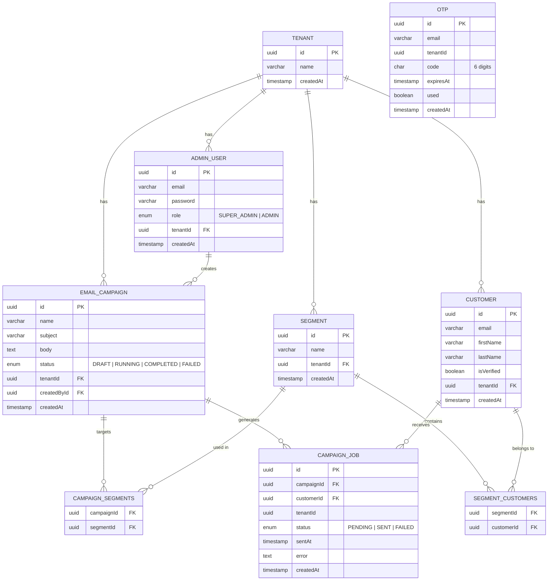
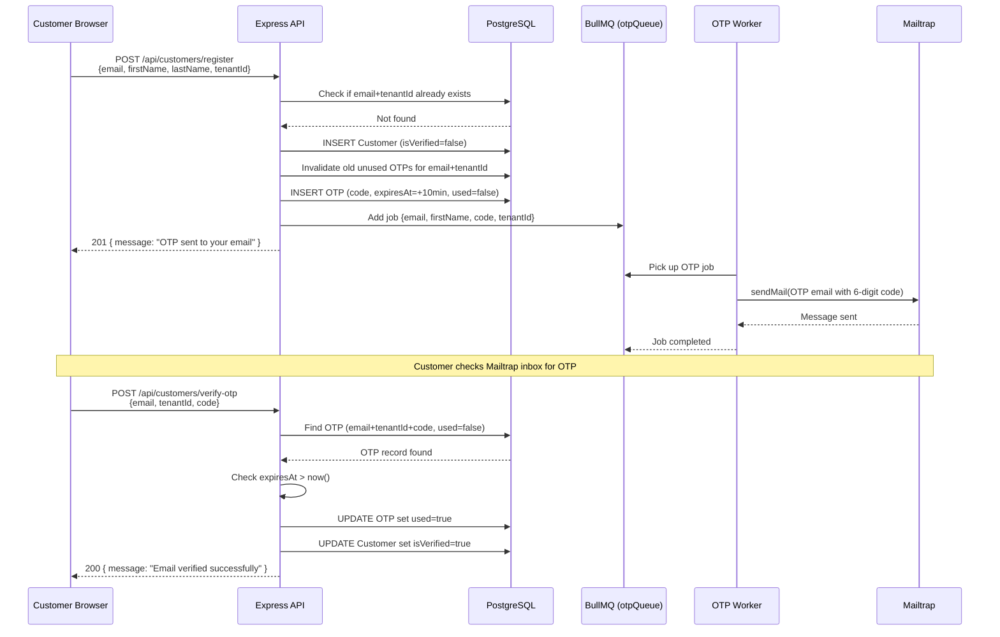
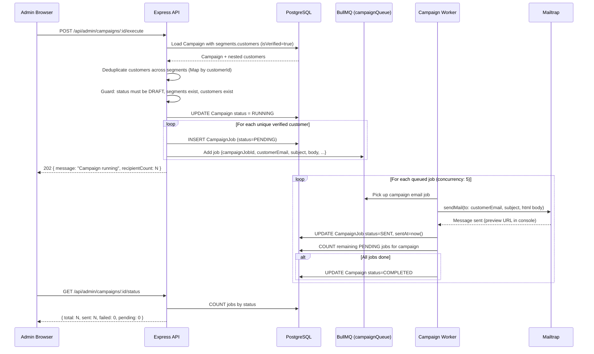
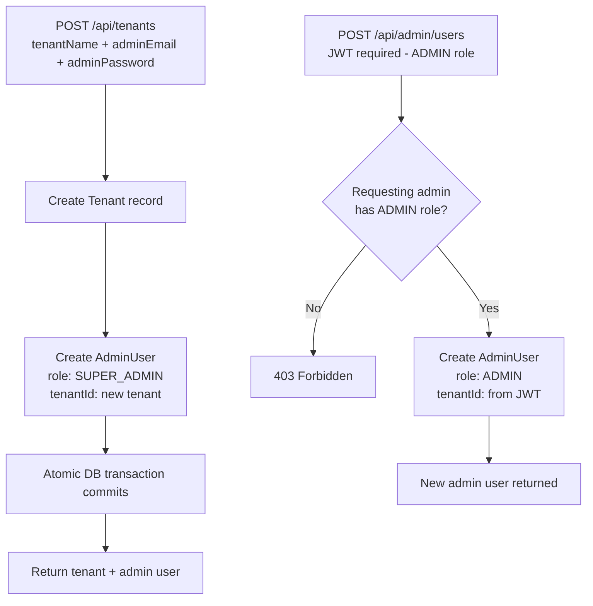
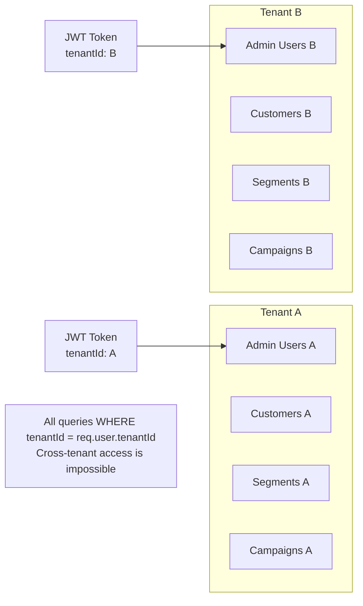

# API TODO List

All APIs you need to implement. Each entry includes the HTTP method, path, auth level, request body, and what it should do.

> **Auth levels:**
> - `Public` — no token required
> - `JWT` — any valid admin JWT
> - `ADMIN` — JWT with role `ADMIN` or `SUPER_ADMIN`
> - `SUPER_ADMIN` — JWT with role `SUPER_ADMIN` only

---

## Tenant Management

| # | Method | Path | Auth | Description |
|---|--------|------|------|-------------|
| T1 | `POST` | `/api/tenants` | Public | Create a tenant + its first admin user (SUPER_ADMIN role) in a single DB transaction. Body: `{ tenantName, adminEmail, adminPassword }` |
| T2 | `GET` | `/api/tenants` | SUPER_ADMIN | List all tenants in the system |
| T3 | `GET` | `/api/tenants/:id` | SUPER_ADMIN | Get a single tenant by ID |
| T4 | `PATCH` | `/api/tenants/:id` | SUPER_ADMIN | Update tenant name. Body: `{ name }` |
| T5 | `DELETE` | `/api/tenants/:id` | SUPER_ADMIN | Delete tenant and cascade-delete all its data |

---

## Admin Authentication

| # | Method | Path | Auth | Description |
|---|--------|------|------|-------------|
| A1 | `POST` | `/api/admin/auth/login` | Public | Login with email + password. Returns JWT containing `{ id, tenantId, role }`. Body: `{ email, password }` |
| A2 | `GET` | `/api/admin/auth/me` | JWT | Return the currently logged-in admin user's profile (decoded from JWT, fetched from DB) |

---

## Admin User Management

All routes are scoped to the requesting admin's `tenantId` from the JWT.

| # | Method | Path | Auth | Description |
|---|--------|------|------|-------------|
| AU1 | `POST` | `/api/admin/users` | ADMIN | Create a new admin user in the same tenant. Body: `{ email, password, role }` where role is `ADMIN` |
| AU2 | `GET` | `/api/admin/users` | ADMIN | List all admin users in the requesting admin's tenant |
| AU3 | `GET` | `/api/admin/users/:id` | ADMIN | Get a single admin user (must belong to same tenant) |
| AU4 | `PATCH` | `/api/admin/users/:id` | ADMIN | Update email or role of an admin user in the same tenant. Body: `{ email?, role? }` |
| AU5 | `DELETE` | `/api/admin/users/:id` | ADMIN | Delete an admin user from the tenant. Should prevent deleting yourself. |

---

## Customer Self-Registration & OTP

These are public-facing APIs called from the customer HTML pages. No JWT needed.

| # | Method | Path | Auth | Description |
|---|--------|------|------|-------------|
| CR1 | `POST` | `/api/customers/register` | Public | Customer submits registration. Creates a `Customer` record with `isVerified: false`, generates a 6-digit OTP (10-min expiry), stores it in the `otps` table, queues an OTP email via BullMQ. Body: `{ email, firstName, lastName, tenantId }` |
| CR2 | `POST` | `/api/customers/verify-otp` | Public | Customer submits the OTP code. Validate: code matches, not expired, not already used. On success: mark `Customer.isVerified = true`, mark `OTP.used = true` (use a DB transaction). Body: `{ email, tenantId, code }` |
| CR3 | `POST` | `/api/customers/resend-otp` | Public | Invalidate all unused OTPs for this `email + tenantId` (set `used = true`), generate a new OTP, queue a new OTP email. Body: `{ email, tenantId }` |

---

## Admin — Customer Management

All routes are scoped to the requesting admin's `tenantId`.

| # | Method | Path | Auth | Description |
|---|--------|------|------|-------------|
| AC1 | `GET` | `/api/admin/customers` | ADMIN | List all customers in the tenant. Supports optional query param: `?verified=true` or `?verified=false` for filtering |
| AC2 | `GET` | `/api/admin/customers/:id` | ADMIN | Get a single customer by ID (must belong to same tenant) |
| AC3 | `DELETE` | `/api/admin/customers/:id` | ADMIN | Delete a customer from the tenant |

---

## Segment Management

All routes are scoped to the requesting admin's `tenantId`.

| # | Method | Path | Auth | Description |
|---|--------|------|------|-------------|
| S1 | `POST` | `/api/admin/segments` | ADMIN | Create a new segment. Body: `{ name }` |
| S2 | `GET` | `/api/admin/segments` | ADMIN | List all segments for the tenant |
| S3 | `GET` | `/api/admin/segments/:id` | ADMIN | Get a single segment including its customer list |
| S4 | `PATCH` | `/api/admin/segments/:id` | ADMIN | Update segment name. Body: `{ name }` |
| S5 | `DELETE` | `/api/admin/segments/:id` | ADMIN | Delete a segment (does NOT delete the customers, only the segment and its memberships) |
| S6 | `POST` | `/api/admin/segments/:id/customers` | ADMIN | Add one or more customers to a segment. Body: `{ customerIds: string[] }` |
| S7 | `DELETE` | `/api/admin/segments/:id/customers` | ADMIN | Remove one or more customers from a segment. Body: `{ customerIds: string[] }` |

---

## Campaign Management

All routes are scoped to the requesting admin's `tenantId`.

| # | Method | Path | Auth | Description |
|---|--------|------|------|-------------|
| C1 | `POST` | `/api/admin/campaigns` | ADMIN | Create a new campaign in `DRAFT` status. Body: `{ name, subject, body }` |
| C2 | `GET` | `/api/admin/campaigns` | ADMIN | List all campaigns for the tenant (include status in response) |
| C3 | `GET` | `/api/admin/campaigns/:id` | ADMIN | Get campaign details including attached segments and job stats |
| C4 | `PATCH` | `/api/admin/campaigns/:id` | ADMIN | Update campaign content. Only allowed when status is `DRAFT`. Body: `{ name?, subject?, body? }` |
| C5 | `DELETE` | `/api/admin/campaigns/:id` | ADMIN | Delete a campaign. Only allowed when status is `DRAFT`. |
| C6 | `POST` | `/api/admin/campaigns/:id/segments` | ADMIN | Attach one or more segments to a campaign. Body: `{ segmentIds: string[] }` |
| C7 | `DELETE` | `/api/admin/campaigns/:id/segments` | ADMIN | Detach one or more segments from a campaign. Body: `{ segmentIds: string[] }` |
| C8 | `POST` | `/api/admin/campaigns/:id/execute` | ADMIN | Execute the campaign: fetch all verified customers across all attached segments (deduplicate by customerId), create a `CampaignJob` DB record per customer (status: `PENDING`), enqueue a BullMQ job per customer, set campaign status → `RUNNING`. Guards: campaign must be `DRAFT`, must have segments attached, segments must contain at least one verified customer. |
| C9 | `GET` | `/api/admin/campaigns/:id/status` | ADMIN | Return execution stats: `{ total, sent, failed, pending }` by counting `CampaignJob` records grouped by status |

---

## Implementation Notes

### Tenant isolation
Every service method must filter by `tenantId` taken from `req.user.tenantId` (decoded from JWT). Never trust a `tenantId` from the request body for authenticated routes.

### OTP generation
```
const code = Math.floor(100000 + Math.random() * 900000).toString(); // 6 digits
const expiresAt = new Date(Date.now() + 10 * 60 * 1000); // 10 minutes from now
```

# System Diagrams

## Entity Relationship Diagram



---

## Customer Registration + OTP Verification Flow



---

## Campaign Execution Flow



---

## Admin User Creation Flow



---

## Multi-Tenancy Isolation Model


